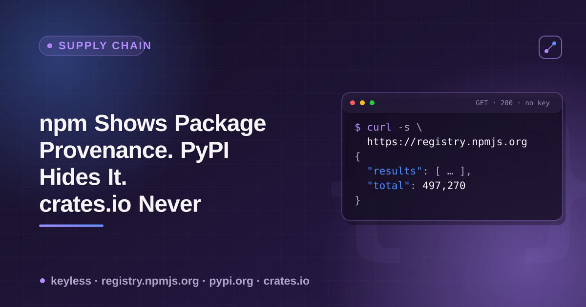

# npm, PyPI & crates.io build provenance — a cheatsheet



All three major package registries now support some form of cryptographic build provenance — proof that a release came from a specific CI workflow at a specific commit, not from a maintainer's laptop or a stolen token. None of them expose it the same way, and one of them exposes it on an endpoint almost nothing queries by default. This is the reference for exactly where to look, checked live against real packages.

## Where each registry actually puts it

| Registry | Where it lives | Endpoint | Visible on the "obvious" API? |
|---|---|---|---|
| npm | `versions[x].dist.attestations` | `GET https://registry.npmjs.org/{name}` | **Yes** — same endpoint as version/license/downloads |
| PyPI | `files[].provenance` (a URL) | `GET https://pypi.org/simple/{name}/` with `Accept: application/vnd.pypi.simple.v1+json` | **No** — absent from the classic `GET https://pypi.org/pypi/{name}/json` |
| crates.io | *(not exposed)* | `GET https://index.crates.io/{path}` (sparse index) | **No** — no field for it exists in this endpoint at all, regardless of whether the crate used Trusted Publishing |

## npm: check `dist.attestations` on the version you care about

```bash
curl -s https://registry.npmjs.org/zod | python3 -c "
import json, sys
d = json.load(sys.stdin)
latest = d['dist-tags']['latest']
dist = d['versions'][latest]['dist']
print('has attestations:', 'attestations' in dist)
print(dist.get('attestations'))
"
```

Verified live 2026-09-14 across 25 well-known packages: 13/25 (52%) carry `dist.attestations` on their latest version (`react`, `react-dom`, `axios`, `webpack`, `next`, `vue`, `vite`, `esbuild`, `zod`, `@actions/core`, `turbo`, `tsx`, `semver`). 12/25 do not — notably `npm` itself, `eslint`, `prettier`, `typescript`, `chalk`, `commander`, `yargs`, `dotenv`, `lodash`, `express`, `angular`, `jquery`. This sample skews toward actively-CI'd projects; a broader jsDelivr-top-2000 study (found via search, not independently re-run) put real-world adoption closer to 12.6% — treat 52% as a ceiling, not a baseline.

Fetch the bundle itself for the full Sigstore/Rekor material:

```bash
curl -s "https://registry.npmjs.org/-/npm/v1/attestations/zod@4.6.5"
```

## PyPI: the classic JSON API has nothing. The Simple API has it — behind a content-type header.

```bash
# The endpoint almost every tool uses — has NO provenance field at all:
curl -s https://pypi.org/pypi/pip/json | python3 -c "
import json, sys
print(sorted(json.load(sys.stdin)['urls'][0].keys()))
"

# The endpoint that actually has it — requires the PEP 691 Accept header:
curl -s -H "Accept: application/vnd.pypi.simple.v1+json" \
  https://pypi.org/simple/pip/ | python3 -c "
import json, sys
files = json.load(sys.stdin)['files']
print(files[-1]['filename'], '→', files[-1].get('provenance'))
"
```

Verified live 2026-09-14: 0/11 popular packages (`requests`, `urllib3`, `pip`, `cryptography`, `build`, `twine`, `hatchling`, `pytest`, `sampleproject`, `setuptools`, `pip-tools`) have any provenance-shaped key on the classic `/pypi/{name}/json` endpoint. On the Simple API with the special `Accept` header, 17/20 sampled packages (85%) had a `provenance` URL on their latest release — `django`, `setuptools` and `ruff` were the exceptions in this sample. The `provenance` URL resolves to a real Sigstore certificate; for `pip` 26.2.1 it decodes to `github.com/pypa/pip/.github/workflows/release.yml` plus the exact commit SHA and Actions run.

## crates.io: Trusted Publishing verifies identity at publish time, but leaves no trace in the sparse index

```bash
# The actual endpoint cargo reads when resolving dependencies:
curl -s https://index.crates.io/se/rd/serde | tail -1 | python3 -m json.tool
```

Verified live 2026-09-14 on `serde` and `tokio`: the sparse index line for a version carries `name`, `vers`, `deps`, `cksum`, `features`, `features2`, `yanked`, `rust_version`, `pubtime`, `v` — no field about how or where the crate was built. crates.io added OIDC-based Trusted Publishing in 2025–2026 (per RFC 3691 / `rust-lang/crates-io-auth-action`, not independently re-verified this session — crates.io's own docs weren't reachable), so the registry *can* now cryptographically verify who is allowed to publish. That verification simply isn't recorded anywhere a downstream reader of the index can see, unlike npm and PyPI.

## Practical takeaway

- **npm** — check `dist.attestations` on the specific version; don't assume a popular package has it just because the feature has existed since 2023.
- **PyPI** — query the Simple API with the PEP 691 JSON `Accept` header, not the classic `/pypi/{name}/json` endpoint most tooling defaults to; the latter will silently under-report every package that actually uses Trusted Publishing.
- **crates.io** — there is currently no live, per-version signal to check from the sparse index, even for crates published under full Trusted Publishing.
- All three: a present attestation proves *this build came from this workflow at this commit*, not that the workflow or commit were trustworthy. Treat it as one input, not a safety verdict.

This is one input into what my [Package Registry Scraper](https://apify.com/ponderable_hydrometer/package-registry-scraper) actor normalizes into one row per dependency across all three registries. The story behind why I went looking for this is on dev.to — cross-link below is a best-guess slug (dev.to appends a random hash suffix on publish, sometimes truncating too), confirm/fix at publish time: [I Wanted to Check If a Package Was Really Built by CI, Not Someone's Laptop](https://dev.to/ronin13/i-wanted-to-check-if-a-package-was-really-built-by-ci-not-someones-laptop-npm-shows-it-pypi-2m3m).
